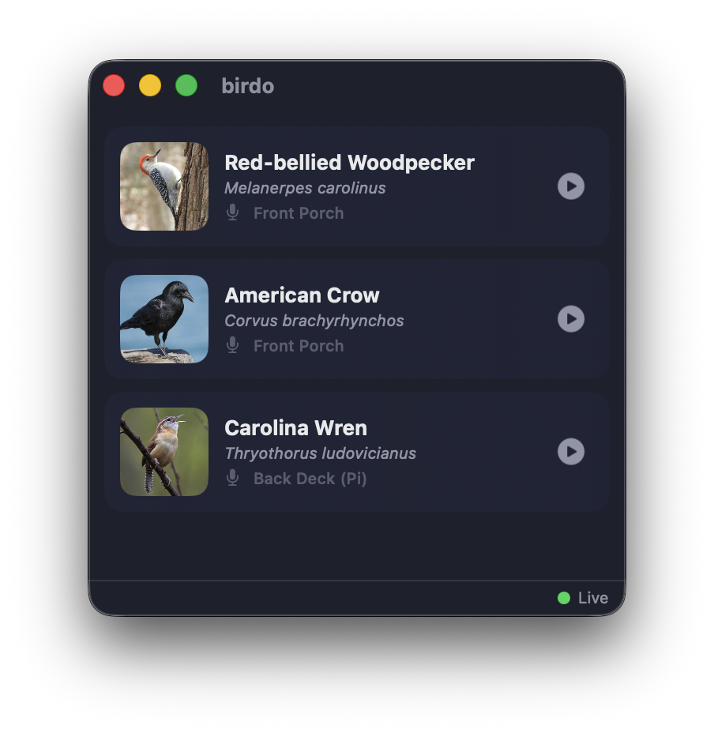

# birdo

A small native macOS app that shows which birds your [BirdNET-Go](https://github.com/tphakala/birdnet-go) station is hearing right now.

birdo mirrors the "currently hearing" section of the BirdNET-Go dashboard in a compact window you can leave in the corner of your screen. Each bird appears as a card with its photo, common and scientific names, and the microphone that heard it. A play button streams the recorded clip. When the yard is quiet, the app shows a simple "Listening…" state.

## Features

- **Live updates** over the BirdNET-Go server-sent event stream — no polling, no page refreshes
- **One card per active bird**, with photo, names, and audio source; cards animate in and out as birds start and stop singing
- **Clip playback**: hear the actual recording that triggered each detection
- **Connection status** at a glance, with automatic reconnection and backoff
- **Native SwiftUI** throughout — no webview

## Requirements

- macOS 26 or later
- A running [BirdNET-Go](https://github.com/tphakala/birdnet-go) instance reachable from your Mac (v2 API)

## Getting started

1. Open `birdo.xcodeproj` in Xcode 26 or later.
2. Build and run (⌘R).
3. On first launch, enter your BirdNET-Go server URL. birdo verifies the server answers before saving.

Change the server later in **Settings** (⌘,); the app reconnects immediately.

## How it works

birdo talks to four BirdNET-Go v2 API endpoints:

| Endpoint | Purpose |
|---|---|
| `GET /api/v2/detections/stream` | SSE stream; `pending` events carry the currently-heard birds |
| `GET /api/v2/media/image/{species}` | Species photo |
| `GET /api/v2/audio/{id}` | Recorded clip for a detection |
| `GET /api/v2/detections/recent` | Seeds clip IDs at launch |

The app is sandboxed with only the outgoing-network entitlement. Bird photos come from your BirdNET-Go server, which sources them from providers such as [Avicommons](https://avicommons.org); hover over a photo to see its credit.

## License

birdo is licensed under the GNU Affero General Public License v3.0. See [LICENSE](LICENSE) for the full text.
